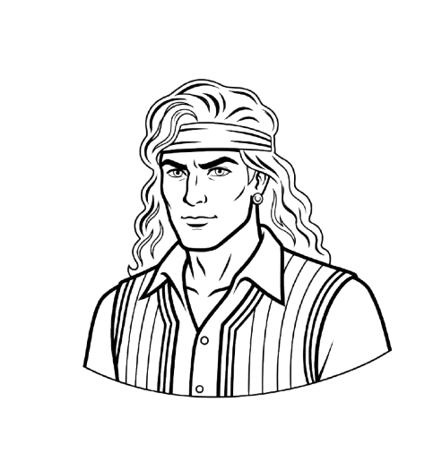
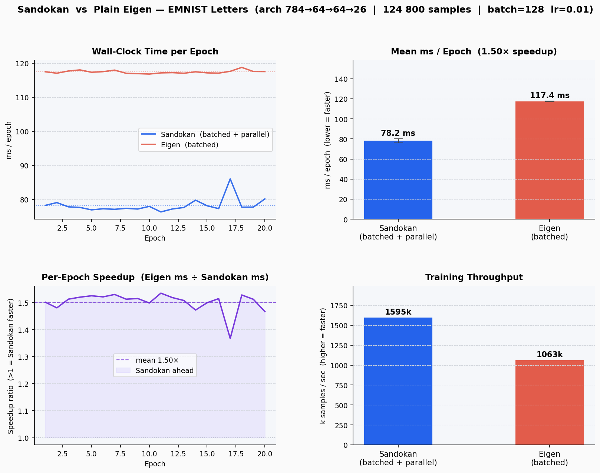
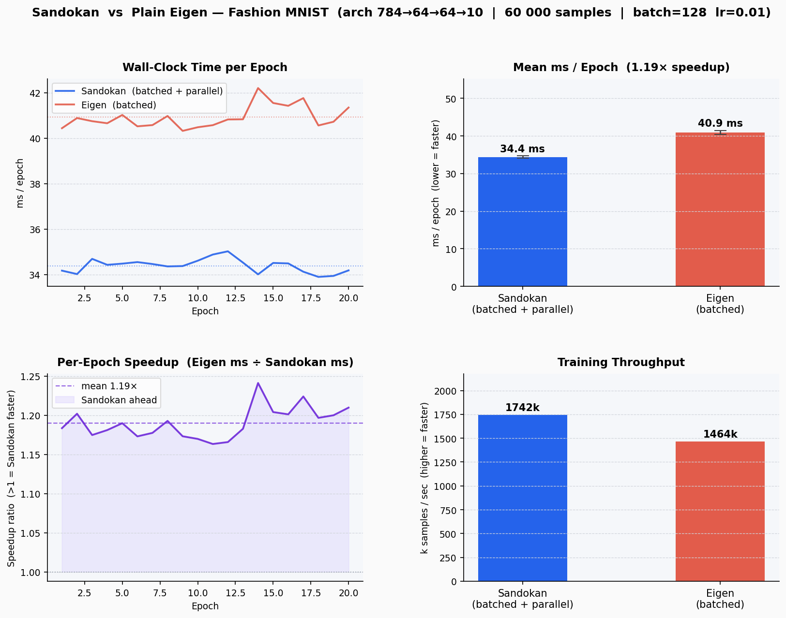

<a id="readme-top"></a>

[![Contributors][contributors-shield]][contributors-url]
[![Forks][forks-shield]][forks-url]
[![Stargazers][stars-shield]][stars-url]
[![Issues][issues-shield]][issues-url]
[![License][license-shield]][license-url]

<br />
<div align="center">
  <a href="https://github.com/your_username/Sandokan">
    
  </a>

  <h1 align="center">Sandokan</h1>

  <p align="center">
    <em>Train with reasoning, optimize with precision.</em>
    <br />
    A from-scratch C++ neural network training engine — no Python, no PyTorch.
    <br /><br />
    <a href="#core-features"><strong>Explore the docs »</strong></a>
    &nbsp;&middot;&nbsp;
    <a href="https://github.com/your_username/Sandokan/issues/new?labels=bug">Report Bug</a>
    &nbsp;&middot;&nbsp;
    <a href="https://github.com/your_username/Sandokan/issues/new?labels=enhancement">Request Feature</a>
  </p>
</div>

---

<!-- TABLE OF CONTENTS -->
<details>
  <summary>Table of Contents</summary>
  <ol>
    <li><a href="#about">About</a></li>
    <li>
      <a href="#core-features">Core Features</a>
      <ul>
        <li><a href="#module-system">Module System</a></li>
        <li><a href="#pmad-slab-allocator">PMAD Slab Allocator</a></li>
        <li><a href="#dataset-abstractions">Dataset Abstractions</a></li>
        <li><a href="#optimizers-and-learning-rate-schedulers">Optimizers and Schedulers</a></li>
        <li><a href="#loss-functions">Loss Functions</a></li>
        <li><a href="#training-loops">Training Loops</a></li>
        <li><a href="#model-persistence">Model Persistence</a></li>
        <li><a href="#inference">Inference</a></li>
      </ul>
    </li>
    <li><a href="#layers">Layers</a></li>
    <li><a href="#performance">Performance</a></li>
    <li><a href="#accuracy">Accuracy</a></li>
    <li><a href="#build">Build</a></li>
    <li><a href="#examples">Examples</a></li>
    <li><a href="#contributing">Contributing</a></li>
    <li><a href="#license">License</a></li>
  </ol>
</details>

---

## About

Training neural networks in C++ today means dragging in LibTorch (a ~1 GB dependency with a Python runtime assumption) or writing raw BLAS calls with no abstraction. Sandokan fills the gap: a PyTorch-style API at native C++ speed, designed for environments where Python is not an option.

**Drop a single header into any C++ project** and get a complete training pipeline — classification, regression, custom datasets, optimizers, learning rate schedules, and model persistence — backed by a custom slab allocator and Apple AMX acceleration.

**Built for:**
- Embedded systems and edge devices with tight memory budgets
- Game engines and real-time systems requiring sub-millisecond inference
- Trading systems and other latency-sensitive C++ codebases
- Any environment where on-device learning must happen without a Python runtime

### Built With

* [![C++][cpp-shield]][cpp-url]
* [![Eigen][eigen-shield]][eigen-url]
* [![CMake][cmake-shield]][cmake-url]
* [![Apple Accelerate][accelerate-shield]][accelerate-url]

<p align="right">(<a href="#readme-top">back to top</a>)</p>

---

## Core Features

### Module System

Define networks by composing typed submodules. `Submodule<T>` auto-registers with the parent on construction — you cannot accidentally forget a `register_module` call.

```cpp
struct LetterNet : Module {
    Submodule<Linear>   proj { *this, 784, 64 };
    ReLU                relu;
    Submodule<Linear>   head { *this, 64,  26 };

    LetterNet() = default;

    Eigen::MatrixXf forward(const Eigen::MatrixXf& x) override {
        return head.forward(relu.forward(proj.forward(x)));
    }
    Eigen::MatrixXf backward(const Eigen::MatrixXf& dy) override {
        return proj.backward(relu.backward(head.backward(dy)));
    }
};
```

Residual blocks are first-class — the skip connection is a single `+ x` / `+ dy`:

```cpp
struct ResBlock : Module {
    Submodule<Linear> fc1 { *this, 64, 64 };
    ReLU              relu1;
    Submodule<Linear> fc2 { *this, 64, 64 };
    ReLU              relu2;

    ResBlock() = default;

    Eigen::MatrixXf forward(const Eigen::MatrixXf& x) override {
        return relu2.forward(fc2.forward(relu1.forward(fc1.forward(x)))) + x;
    }
    Eigen::MatrixXf backward(const Eigen::MatrixXf& dy) override {
        return fc1.backward(relu1.backward(fc2.backward(relu2.backward(dy)))) + dy;
    }
};
```

<p align="right">(<a href="#readme-top">back to top</a>)</p>

---

### PMAD Slab Allocator

The standard allocator story for neural network training is painful: every gradient buffer is a separate heap allocation, the allocator is called thousands of times per epoch, and the heap fragments over long training runs as buffers are freed and reallocated at different sizes. On embedded targets — where `malloc` may not even be available — this is a non-starter.

**PMAD (Pre-allocated Memory Arena for Derivatives)** solves this at the layer level:

- **Single allocation, zero fragmentation.** PMAD walks the network topology before training begins, computes the exact size class required for every gradient buffer across all layers, and satisfies all of them from one contiguous slab. During training there are zero `malloc`/`free` calls — gradient memory is carved from the slab at fixed offsets.
- **Cache-friendly layout.** Because all gradient buffers for a forward/backward pass are packed contiguously, they fit in L2/L3 cache together. Pointer chasing across scattered heap blocks disappears.
- **Deterministic latency.** No allocator lock contention, no OS page-fault surprises mid-epoch. The slab is faulted in once at init time; subsequent accesses are always hits.
- **Topology-aware sizing.** Size classes are derived automatically from the network architecture — you do not need to tune buffer sizes manually. Add a layer, re-call `init_pmad_for()`, and the slab is rebuilt correctly.

```cpp
LetterNet net;
init_pmad_for(net);   // walks topology → computes size classes → allocates slab → migrates gradient pointers
```

Combined with Apple Accelerate/AMX for batched GEMM, PMAD is the primary reason Sandokan's batched training path runs **1.5× faster than plain Eigen** on EMNIST Letters and **1.19× faster** on Fashion MNIST.

<p align="right">(<a href="#readme-top">back to top</a>)</p>

---

### Dataset Abstractions

Sandokan provides two dataset backends that handle normalization, shuffling, and memory layout so the training loop never sees raw bytes.

#### `ImageDataset` — mmap-backed IDX loader

Image data is memory-mapped directly from disk. Pages are faulted on demand during batch assembly — the working set stays bounded regardless of dataset size, which matters on devices with limited RAM.

**Why mmap instead of `fread`?**
- The OS page cache deduplicates reads across processes and runs. A second training run on the same data costs zero disk I/O.
- Random-access shuffling across 100k+ images is free — there is no seek penalty and no need to load the full dataset into RAM upfront.
- On Apple Silicon, large contiguous mmap regions are prefetched by the AMX DMA engine, giving free hardware prefetch for sequential batch access patterns.

```cpp
ImageDataset train = load_emnist_letters("data/Emnist Letters", /*train=*/true);
ImageDataset test  = load_emnist_letters("data/Emnist Letters", /*train=*/false);

train.compute_normalization();          // computes per-channel mean and std from training split
test.apply_normalization_from(train);   // applies training statistics — never leaks test distribution
```

Normalization statistics are stored inside the dataset and can be serialized into `.sand` model files so inference-time inputs are normalized identically to training.

#### `TabularDataset` — in-memory column-major store

Numeric CSV and Eigen matrix data is stored in column-major order, matching Eigen's default layout. Columns are contiguous in memory, so feature-wise normalization and batch slicing are single pointer arithmetic operations with no copying.

```cpp
// From CSV — last column is the target by default
TabularDataset ds = load_csv("boston.csv");
ds.compute_normalization();          // z-scores each feature column independently
ds.compute_target_normalization();   // z-scores the target; train_regression() inverts on output

// From Eigen matrices — zero-copy when the matrices are already column-major
TabularDataset ds = TabularDataset::from_matrices(X_features, y_targets);
```

Both dataset types expose the same shuffled-index interface consumed by the training loops, so swapping `ImageDataset` for `TabularDataset` requires no changes to training code.

<p align="right">(<a href="#readme-top">back to top</a>)</p>

---

### Optimizers and Learning Rate Schedulers

```cpp
Adam     optim(1e-3f);
LinearLR sched(optim, 150 /*total epochs*/, 1e-5f /*end lr*/);

train_module(net, sched, train_set, test_set, 150, 128);
```

| Optimizer | Notes |
|-----------|-------|
| `SGD` | Stochastic gradient descent with fixed learning rate |
| `Adam` | Adaptive moments with bias correction |

| Scheduler | Notes |
|-----------|-------|
| `LinearLR` | Linearly decays learning rate from start to end over N epochs |

<p align="right">(<a href="#readme-top">back to top</a>)</p>

---

### Loss Functions

| Loss | Output activation | Use case |
|------|------------------|----------|
| `CrossEntropyLoss` | `Softmax` | Multi-class classification |
| `BCELoss` | `Sigmoid` | Binary / multi-label classification |
| `MSELoss` | Linear (none) | Regression |

`CrossEntropyLoss` folds the Softmax Jacobian into its backward pass — Softmax's own `backward` is a passthrough. This avoids computing the full Jacobian matrix while producing the correct gradient.

<p align="right">(<a href="#readme-top">back to top</a>)</p>

---

### Training Loops

```cpp
// Classification — reports cross-entropy loss + accuracy each epoch
train_module(net, optim, train_set, test_set, epochs, batch_size);

// Regression — normalises targets during training, reports RMSE in original units
train_regression(net, optim, train_set, test_set, epochs, batch_size);
```

Both loops shuffle each epoch, skip partial batches, and call `optim.epoch_end()` for scheduler stepping.

<p align="right">(<a href="#readme-top">back to top</a>)</p>

---

### Model Persistence

Custom `.sand` binary format — 4-word header, optional normalisation block, then Linear weight blocks in DFS traversal order.

```cpp
#include <sandokan/io.h>

save_model(net, "letter_net.sand");                        // weights only
save_model<TabularDataset>(net, "model.sand", ds);         // weights + normalization

load_model(net, "letter_net.sand");
load_model<TabularDataset>(net, "model.sand", ds);
```

<p align="right">(<a href="#readme-top">back to top</a>)</p>

---

### Inference

```cpp
#include <sandokan/inference.h>

auto pred = predict(net, x);              // {label, confidence}
auto topk = predict_topk(net, x, 5);     // top-5 predictions
show_prediction(raw_image, true_label, topk, label_names);  // ASCII art + ranked list
```

<p align="right">(<a href="#readme-top">back to top</a>)</p>

---

## Layers

| Layer | Description |
|-------|-------------|
| `Linear` | Fully connected — He-initialised weights, PMAD-backed gradient buffers |
| `ReLU` | Element-wise rectifier, stores pre-activation for backward pass |
| `Softmax` | Numerically stable column-wise softmax, passthrough backward (CE loss folds in Jacobian) |
| `Sigmoid` | Element-wise sigmoid |

<p align="right">(<a href="#readme-top">back to top</a>)</p>

---

## Performance

Benchmarks run on Apple Silicon (M-series) with `EIGEN_USE_BLAS` (Apple Accelerate / AMX).  
Architecture `784 → 64 → 64 → 26` &nbsp;|&nbsp; batch = 128 &nbsp;|&nbsp; lr = 0.01

### EMNIST Letters — 124 800 training samples

| Backend | Total (ms) | ms / epoch | ms / sample | samples / sec |
|---------|-----------|------------|-------------|---------------|
| Sandokan single-sample | 7 540 | 1 508 | 0.0121 | 82 757 |
| Eigen single-sample | 9 257 | 1 851 | 0.0148 | 67 408 |
| **Sandokan batched + parallel** | **386** | **77** | **0.0006** | **1 615 666** |
| Eigen batched | 614 | 123 | 0.0010 | 1 015 951 |

Sandokan's batched path is **19.5× faster than single-sample** and **1.5× faster than plain Eigen batched**.



### Fashion MNIST — 60 000 training samples

| Backend | ms / epoch | samples / sec |
|---------|-----------|---------------|
| **Sandokan batched + parallel** | **34.4** | **1 742 000** |
| Eigen batched | 40.9 | 1 464 000 |

**Speedup: 1.19×**



<p align="right">(<a href="#readme-top">back to top</a>)</p>

---

## Accuracy

| Dataset | Architecture | Optimizer | Result |
|---------|-------------|-----------|--------|
| EMNIST Letters | 784 → 64 → ResBlock(64) → 26 | Adam + LinearLR | **88.25% test accuracy** |
| Fashion MNIST | 784 → 64 → 64 → 10 | SGD | converges to ~85% |

<p align="right">(<a href="#readme-top">back to top</a>)</p>

---

## Build

**Requirements:** C++17, CMake ≥ 3.15, Eigen 3.

```bash
cmake -B build .
cmake --build build -j
```

For Apple AMX acceleration (strongly recommended on Apple Silicon):

```cmake
target_compile_definitions(sandokan INTERFACE EIGEN_USE_BLAS)
target_link_libraries(sandokan INTERFACE "-framework Accelerate")
```

<p align="right">(<a href="#readme-top">back to top</a>)</p>

---

## Examples

| Example | Task | Dataset |
|---------|------|---------|
| `examples/emnist_letters` | 26-class letter recognition | EMNIST Letters |
| `examples/tabular_demo` | Generic CSV classification | any numeric CSV |
| `examples/benchmark` | Full timing sweep (single / batched / Module) | EMNIST Letters |
| `examples/emnist_bench` | Sandokan vs Eigen — per-epoch timing | EMNIST Letters |
| `examples/fashion_mnist_bench` | Sandokan vs Eigen — per-epoch timing | Fashion MNIST |

Run examples from the **project root** so relative `data/` paths resolve:

```bash
./build/examples/emnist_letters/emnist_letters
./build/examples/emnist_bench/emnist_bench
./build/examples/fashion_mnist_bench/fashion_mnist_bench
```

<p align="right">(<a href="#readme-top">back to top</a>)</p>

---

## Contributing

Contributions are welcome. If you have a suggestion that would make this better, please fork the repo and create a pull request, or open an issue with the tag `enhancement`.

1. Fork the Project
2. Create your Feature Branch (`git checkout -b feature/AmazingFeature`)
3. Commit your Changes (`git commit -m 'Add some AmazingFeature'`)
4. Push to the Branch (`git push origin feature/AmazingFeature`)
5. Open a Pull Request

<p align="right">(<a href="#readme-top">back to top</a>)</p>

---

## License

Distributed under the MIT License. See `LICENSE` for more information.

<p align="right">(<a href="#readme-top">back to top</a>)</p>

---

<!-- MARKDOWN LINKS & IMAGES -->
[contributors-shield]: https://img.shields.io/github/contributors/your_username/Sandokan.svg?style=for-the-badge
[contributors-url]: https://github.com/your_username/Sandokan/graphs/contributors
[forks-shield]: https://img.shields.io/github/forks/your_username/Sandokan.svg?style=for-the-badge
[forks-url]: https://github.com/your_username/Sandokan/network/members
[stars-shield]: https://img.shields.io/github/stars/your_username/Sandokan.svg?style=for-the-badge
[stars-url]: https://github.com/your_username/Sandokan/stargazers
[issues-shield]: https://img.shields.io/github/issues/your_username/Sandokan.svg?style=for-the-badge
[issues-url]: https://github.com/your_username/Sandokan/issues
[license-shield]: https://img.shields.io/github/license/your_username/Sandokan.svg?style=for-the-badge
[license-url]: https://github.com/your_username/Sandokan/blob/main/LICENSE
[cpp-shield]: https://img.shields.io/badge/C%2B%2B17-00599C?style=for-the-badge&logo=cplusplus&logoColor=white
[cpp-url]: https://en.cppreference.com/w/cpp/17
[eigen-shield]: https://img.shields.io/badge/Eigen-3.4-brightgreen?style=for-the-badge
[eigen-url]: https://eigen.tuxfamily.org
[cmake-shield]: https://img.shields.io/badge/CMake-3.15+-blue?style=for-the-badge&logo=cmake&logoColor=white
[cmake-url]: https://cmake.org
[accelerate-shield]: https://img.shields.io/badge/Apple%20Accelerate-AMX-black?style=for-the-badge&logo=apple&logoColor=white
[accelerate-url]: https://developer.apple.com/accelerate/
